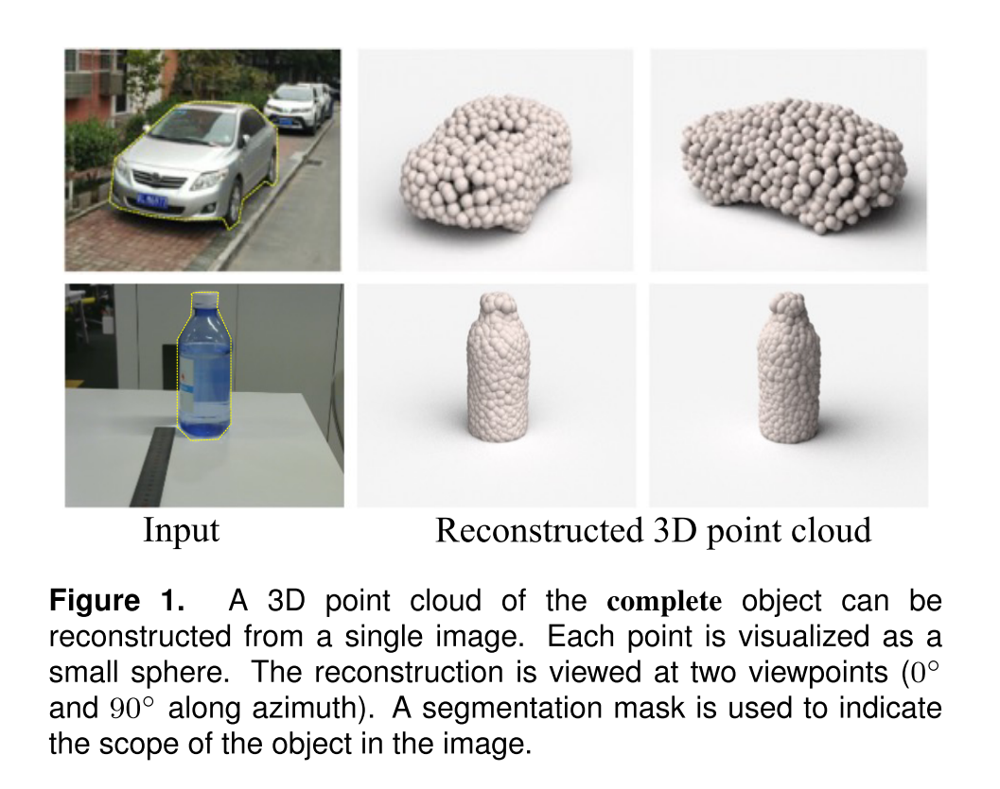
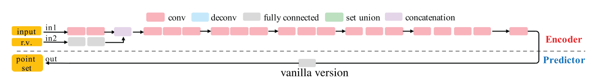
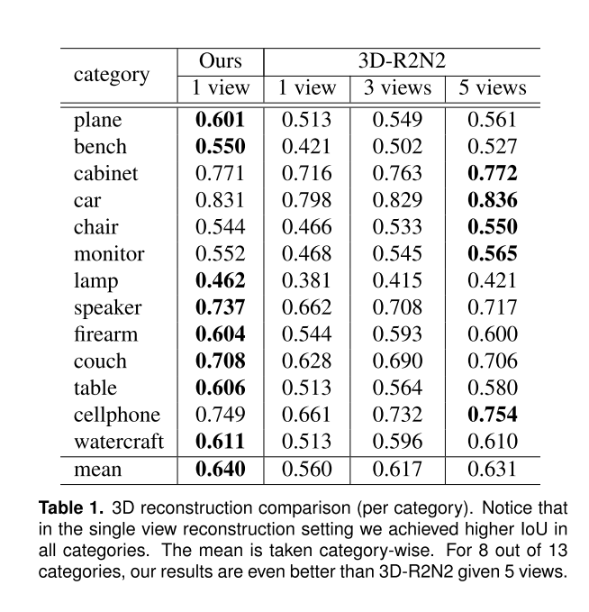

# 论文阅读：单张图片进行3D重建的点云生成网络

> **论文题目**：*A* *Point* *Set* *Generation* *Network* *for* *3D* *Object* *Reconstruction* *from* *a* *Single* Image
>
> **作者**：H Fan, H Su, LJ Guibas
> **发表**：CVPR2017
> **引用频次**：665
> **原文链接**：[原文链接](https://openaccess.thecvf.com/content_cvpr_2017/papers/Fan_A_Point_Set_CVPR_2017_paper.pdf)

## 一、背景

*用点云做三维重建的开山之作。*

单张照片进行3D重建的困难：

- 单张图片给出的信息极其有限，不足以生成绝对完美的重建结构。
- 物体的背部信息等于没有。

本文使用点云解决了从单个图像进行3D重建的问题。 

跟原有的解决方案相比，点云表示可能无法有效地表示底层连续3D几何图形，但就本文的目标而言，它具有许多优势：
- 点云是一种简单、统一的结构，更容易学习。
- 当涉及几何变换和变形时，由于不必更新连接性，因此点云允许简单的操作。

网络的目标是估计图像的可见部分的深度，并对象几何体的非可见部分产生假想，并评估几种不同假想的可信度。 从统计学的角度来看，最理想的情况是我们能够完全复现出真实空间的景观，或者能够相应地对可信的候选人进行选择（允许一张图片有多重联想情况）。

本文称最终算法是一个条件采样器（conditional sampler），它在给定输入图像的情况下，从“Ground Truth“空间中选择可信的点云。

#### 文章提到的贡献

- 在从单个图像进行3D重建的任务上，我们应用了点云生成网络，并且性能大大优于现有技术；
- 系统地探索点云生成网络的体系结构和损失函数设计中的问题；
- 讨论并解决了从单一图像任务进行3D重建时的Ground Truth的不确定问题。

## 二、方法

#### 1、定义

- 点云如何表示
    $$
    	S=\{(x_{i},y_{i},z_{i})\}_{i=1}^{N}
    $$
    这就体现出来点集的一个优点就是无序性，在旋转或缩放对象时，坐标值可以直接进行简单的线性变换。
    关于点云中点的个数，文中设置为1024，作者认为这个个数已经足够表现大部分的几何形状。 

- 在模型构建的时候由于单个2D图像的局限性，即使是人也无法猜出正确的形状，因此从众多模棱两可的‘真像‘中预测结果也是一大难题。因此文中定义了预测出的点集是一个概率分布
	$$
		P( \cdot | I)
	$$
	这就是全文提到的3D重建的随机性和不确定性。
- 由于GT是一个抽样结果，所以我们要训练的是某一个条件样本下的神经网络
	$$
  		S=G(I,r;\theta)
 	$$
 	其中G是生成网络，I是输入图像，Θ表示网络参数，r 是随机变量。

#### 2、网络

- 第一个网络：网络大致由一个编码器和一个解码器构成，编码器是由一系列卷积层和激活函数构成。输入一张图片I和一个向量r，r 用来模拟重建任务中的不确定性，输出的是一个Nx3的矩阵。解码器中的全链接层用来生成点云的坐标。

- 第二个网络：为了更好的使模型作用在大而平滑的物体上，论文提出了改进版。因为每一个点都是被独立预测的，全链接层并不能很好的预测物体的几何结构，所以第二阶段的解码器由两部分组成，一个是全链接层，另一个是反卷积层。全链接层还是生成N个点，而反卷积层则是生成尺寸为HxW的3通道图片，这三个值分别是该点的位置坐标，稍后，全链接层的输出和反卷积层的输出会被合并在一个单元中。这里的跳跃连接增强了流过编码器和预测器的信息流。

- 第三个网络：这一阶段引入了“沙漏结构”，这种深度神经网络重复执行编码和解码操作，从而进一步增强了模型的提取和表达能力。

#### 3、Loss

点云的Loss很好定义，就是预测集和Ground Truth集的距离。

$$
L(\{S_{i}^{pred},S_{i}^{gt}\})=\sum d(\{S_{i}^{pred},S_{i}^{gt}\})
$$

其中i是训练抽样的索引。

文章中列出了度量距离需要的要求：
- 关于点位置可区分； 
- 计算效率高，因为数据将被多次转发和反向传播；
- 对集中的少量异常点具有鲁棒性

##### 倒角距离Chamfer Distance

3D空间的倒角距离常见于点云重建或者3D重建工作。

$$
d_{CD}(S_{1},S_{2})=\sum_{x \in S_{1}} \min_{y \in S_{2}}\left \| x-y \right \| _{2}^{2}+\sum_{y \in S_{2}} \min_{x \in S_{1}}\left \| x-y \right \| _{2}^{2}
$$

以上公式的S1和S2分别表示两组3D点云，第一项代表S1中任意一点x 到S2 的最小距离之和，第二项则表示S2 中任意一点y 到S1 的最小距离之和。如果该距离较大，则说明两组点云区别较大；如果距离较小，则说明重建效果较好。

对于每个点，CD算法都会找到另一个集合中最接近的邻居，并将平方距离求和。从S1和S2中的点位置来看，CD是连续且分段平滑的。 每个点的范围搜索是独立的，因此可以并行化。同样，像KD-tree这样的空间数据结构也可以用来加速最近邻搜索。

尽管简单，但CD在实践中会产生合理的高质量结果。

##### Earth Mover's Distance (EMD)距离 陆地移动距离

EMD的方法则是，找出一个能够映射，该映射能够使S1的点转换成S2的距离最近。从而该映射就是最优映射。

$$
d_{EMD}(S_{1},S_{2})=\min_{\phi :S_{1} \to S_{2}}\sum_{x \in S_{1}}\left \| x-\phi(x) \right \| _{2}
$$

EMD求解需要其运算复杂度较高，平均而言至少是二次方级别。作者使用了一个近似的变通方法，使其满足度量距离需要的要求，并且能够并行化计算。

##### 结论呢，两种方法各有优劣，用哪个都行

总体来说，由于2D转3D的不确定性，网络最终输出的是一个预测点的集合，作者希望网络会倾向于以平均的形式（Mean-shape）综合这些点输出一个最可信的形状。（下图可以看出两种Loss的情况下是如何平均可能的点集的）

- EMD捕获与隐藏变量的平均值相对应的形状。相比之下，CD会引起飞溅的形状，从而模糊了形状的几何结构。
- 为了解决变化部分的不确定性，CD将一些点分布在主体外部的正确位置。而EMD明显失真。

> 问题：如果不能在算法中抑制这些不确定性，即2D图片重构后可能的形状有很多种，那在网络中如何解决

#### 4、产生多个可能的形状

前面提到过，所训练的网络是在某一抽样条件下的训练结果，如果只使用输入图像与前面提到的Loss函数来训练网络，Loss的最小化会使随机性无效，也就是只能训练一个特定条件下的结果，预测的输出也会和最开始从Ground Truth中的那一组抽样同分布。

文章提出了一个方法来模拟3D重建的不确定性，就是通过引入一个随机变量r使输入图片I变得凌乱，这个类似于CGAN（条件生成对抗网络）中的条件变量，这样每一个变量r都会使网络生成一个与原图片不一样的输出结果，n个不同的r就能产生n个不同的点云集合。

这样会生成多个候选3D结构，那么就从这么多个候选结构中，选出距离groundtruth最接近的，作为最终的重建结果，这就是Min-of-N loss（MoN） 的由来。

$$
\min_{\theta} \sum_{k} \min_{r_{j} \\ 1\le j\le n} \{d(G(I_{k},r_{j};\theta),S_{k}^{gt}) \}
$$

作者认为从直觉上来看，我们会相信n次中会至少有一次预测会非常接近真正的答案，因此可以认为这n次预测与真正的答案的距离的最小值应该要最小。后续实验中证明一般设n为2，也就是产生2个预测模型就OK了。

## 效果

最后，作者的实验建立在 ShapeNet数据集上，里面包含了大量的人造3D物体模型，作者运用了其中220K个模型共2000类进行训练。

- 与当时的SOTA方法3D-R2N2比较

- 损失函数中距离量度的不同选择对网络的预测模式有不同的影响。下图例示了相应地由CD和EMD训练的两个网络之间的差异。

## 结束